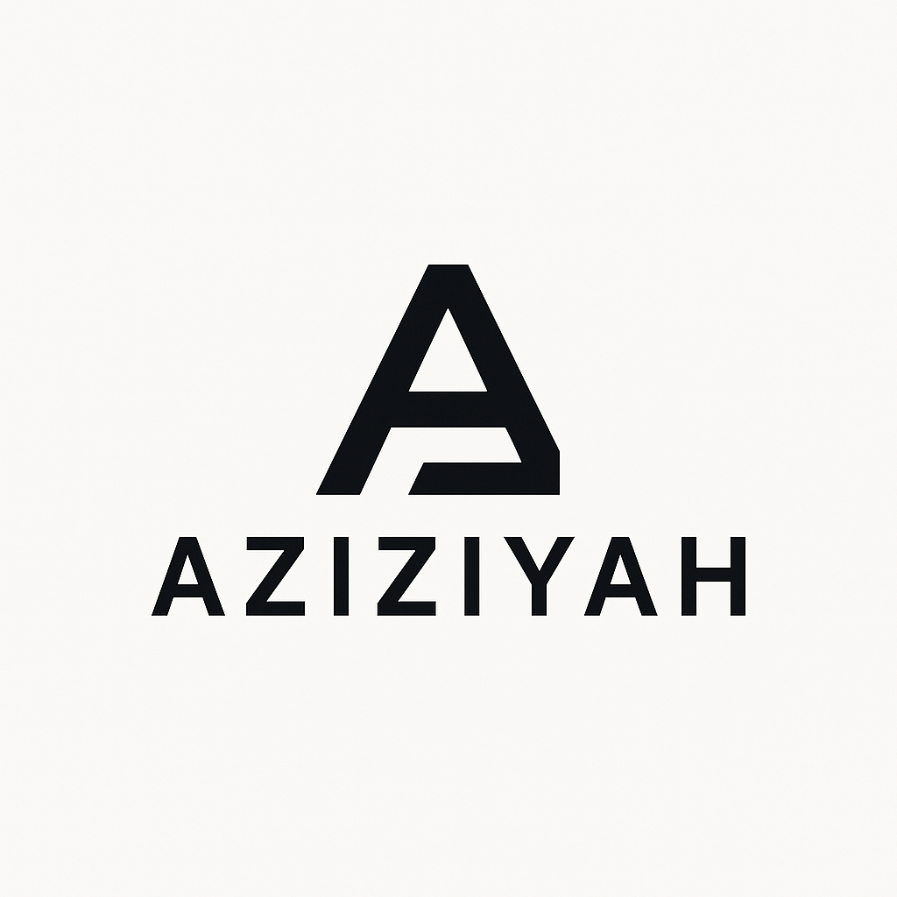
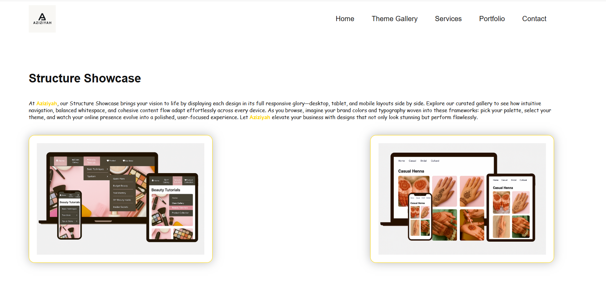
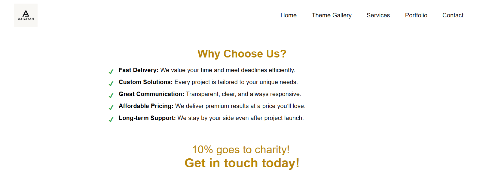

  

# Aziziyah — Creative Tech & Full‑Stack Solutions

Welcome to the official repository for **Aziziyah**, a modern IT and creative technology studio delivering elegant, high‑impact digital experiences.  
We build thoughtful, user‑centered solutions across web, mobile, branding, and automation. Always with clarity, empathy, and proficiency.

## 🚀 What We Do
- **Full‑Stack Web Development** 
  Modern, scalable applications featuring clean architecture and intuitive UX.

- **UI/UX & Product Design**  
  Interfaces designed with clarity, visual hierarchy, and brand personality.

- **Branding & Creative Direction**  
  Identity systems, microcopy, and visual storytelling that feel human and intentional.

- **Client‑Focused Digital Solutions**  
  Websites, dashboards, internal tools, and custom experiences tailored to real business needs.

## 🛠️ Tech Stack & Tools
- **Frontend:** React, Next.js, Tailwind CSS  
- **Backend:** Node.js, Supabase, Firebase  
- **Design:** Figma, Adobe Suite  
- **Other:** API integrations, automation workflows, cloud deployment

## 👩‍💻 About the Founder
**Sumayyah Aziz Ahmed**  
Founder, Lead Developer, and Creative Technologist  
Crafting digital experiences with precision, empathy, and a strong sense of visual identity.

## 🌐 Live Website
Visit the official site: [aziziyah.net](https://aziziyah.net)
  

## 📬 Contact
For collaborations, client work, or inquiries:  
**Email:** aziziyahnet@outlook.com  
**Portfolio:** https://sumayyah-ahmed.github.io/Portfolio/  
**GitHub:** https://github.com/Sumayyah-Ahmed 
**LinkedIn:** https://linkedin.com/in/saa11
